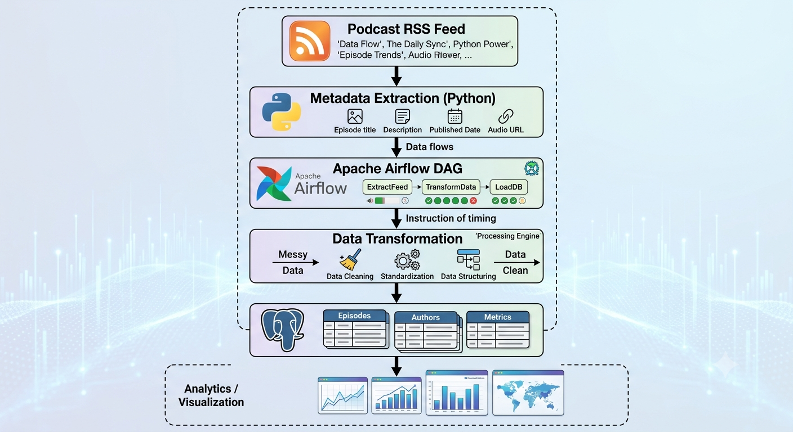

#PODCAST DOWNLOADER PIPELINE

# 🎙️ Podcast Metadata Pipeline | Data Engineering Project

## Overview

This project is an end-to-end **Data Engineering pipeline** that automates the ingestion of podcast data from an RSS feed using **Apache Airflow**. The pipeline is designed to fetch podcast metadata and audio, orchestrate the workflow through a Directed Acyclic Graph (DAG), store the downloaded files locally, and load structured metadata into **PostgreSQL** for downstream processing and analytics.

The project demonstrates key data engineering concepts, including automated workflow orchestration, data ingestion, ETL pipeline design, containerized development with Docker, and relational database integration. It was built to showcase industry-standard practices for designing reliable, scalable, and reproducible data pipelines.

> **Note:** This project focuses on podcast metadata ingestion rather than audio downloads to optimize storage usage while still providing valuable analytical insights.

---

# Project Objectives

* Build an automated data ingestion pipeline
* Orchestrate workflows using Apache Airflow
* Parse podcast RSS feeds
* Store structured metadata inside PostgreSQL
* Run the entire stack using Docker
* Demonstrate production-style data engineering practices

---

# Architecture



---

# Technologies Used

| Technology              | Purpose                            |
| ----------------------- | ---------------------------------- |
| Python                  | Data extraction and transformation |
| Apache Airflow          | Workflow orchestration             |
| PostgreSQL              | Metadata storage                   |
| Docker & Docker Compose | Containerized environment          |
| RSS Feed                | Data source                        |
| SQL                     | Querying stored podcast metadata   |
| Git & GitHub            | Version control                    |

---

# Project Structure

```text
podcast-downloader-pipeline/
│
├── airflow/
│   ├── dags/
│   ├── logs/
│   └── plugins/
│
├── scripts/
│   ├── fetch_feed.py
│   ├── parser.py
│   └── database.py
│
├── docker/
│
├── sql/
│
├── requirements.txt
│
├── docker-compose.yml
│
└── README.md
```

---

# Pipeline Workflow

### 1. RSS Feed Extraction

The pipeline connects to a podcast RSS feed and retrieves the latest available episodes.

Example metadata collected:

* Episode Title
* Podcast Name
* Publication Date
* Episode Description
* Episode Link
* Audio URL
* Episode GUID

---

### 2. Workflow Orchestration

Apache Airflow automates the pipeline by:

* Triggering metadata extraction
* Managing task dependencies
* Monitoring task execution
* Handling retries
* Providing execution logs

---

### 3. Data Storage

After extraction, podcast metadata is loaded into PostgreSQL where it becomes available for querying and downstream analytics.

Example schema:

| Column      | Description      |
| ----------- | ---------------- |
| id          | Primary Key      |
| title       | Episode title    |
| podcast     | Podcast name     |
| published   | Publication date |
| description | Episode summary  |
| audio_url   | Audio file URL   |
| link        | Episode webpage  |

---

# Running the Project

## Clone the repository

```bash
git clone https://github.com/yourusername/podcast-downloader-pipeline.git
```

---

## Navigate to the project

```bash
cd podcast-downloader-pipeline
```

---

## Create and Activate a Virtual Environment

macOS / Linux

python3 -m venv .venv
source .venv/bin/activate

Windows

python -m venv .venv
.venv\Scripts\activate

# Install Dependencies
pip install -r requirements.txt

## Start Docker

```bash
docker compose up -d
```

---

## Launch Airflow

```bash
docker compose up airflow-init

docker compose up
```

---

## Access Airflow

```
http://localhost:8080
```

---

## Run the DAG

1. Open the Airflow UI
2. Enable the Podcast DAG
3. Trigger the DAG manually or wait for the scheduled execution
4. Monitor task execution and logs

---

# Example Output

| Episode                        | Published  | Podcast               |
| ------------------------------ | ---------- | --------------------- |
| Mental Health in the Workplace | 2026-07-01 | Mental Health Podcast |
| Managing Anxiety               | 2026-07-08 | Mental Health Podcast |
| Building Healthy Habits        | 2026-07-15 | Mental Health Podcast |

---

# Skills Demonstrated

* Data Pipeline Development
* ETL Workflow Design
* Apache Airflow
* PostgreSQL
* Docker
* SQL
* Python Automation
* Workflow Scheduling
* RSS Data Processing
* Containerized Development
* Data Engineering Best Practices

---

# Future Improvements

* Incremental data loading
* Data quality validation
* Structured logging
* Unit and integration testing
* CI/CD with GitHub Actions
* Cloud deployment (AWS or Azure)
* Data warehouse integration
* Analytics dashboard using Power BI or Apache Superset

---

# Key Learning Outcomes
 workflow orchestration, containerized environments, relational database design, ETL principles, and building reproducible data pipelines.

---

# Author

**Gift David**

Aspiring Data Engineer passionate about building scalable data pipelines, workflow automation, and analytics solutions.

Feel free to connect or explore my other projects.

